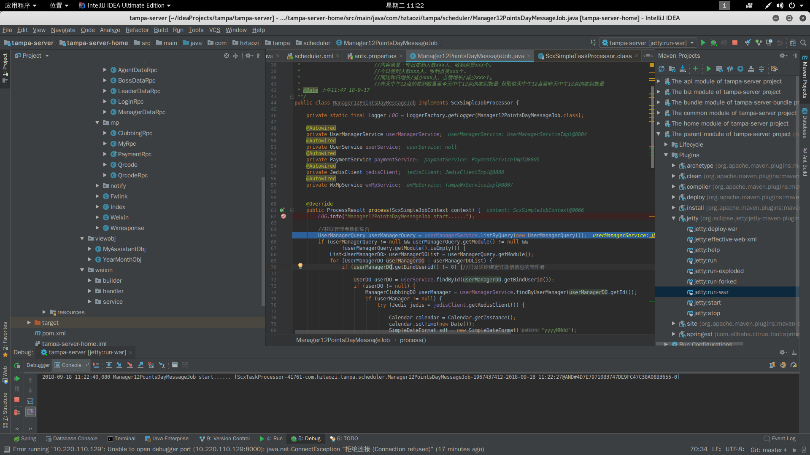

# headers
# This is an h1 tag
## This is an h2 tag
###### This is an h6 tag

# Lists anordered
* Item 1
* Item 2
    * Item 2_1
    * Item 2_2
        * Item 2_2_1
        
# Images

Format: 

# Emphasis
1. *This text will be italic*
2. **This text will be italic**
3. _This will also be italic_
4. __This will also be italic__

# Ordered Lists
1. Item 1
2. Item 2
    1. Item 2a
        1. Item 2a_i
        2. Item 2a_ii
    2. Item 2b
3. Item 3
    * Item 3a
    * Item 3b
    
# Links
https://github.com - automatic!
[Github](https://github.com)

# BLOCKQUOTES
As Grace Hopper said:
> i've always been more interested
> in the future than in the past.

# EMOJI
[表情地址](https://www.webpagefx.com/tools/emoji-cheat-sheet/)

~~删除线~~

# 分割线
***
---
___