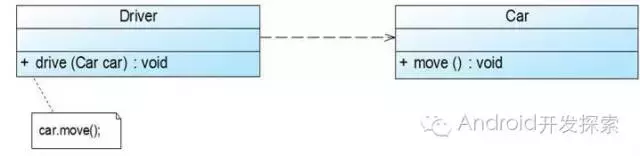
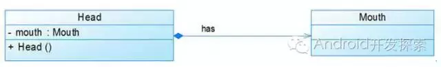
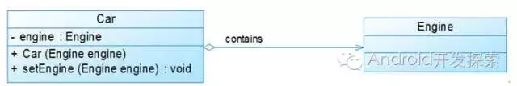
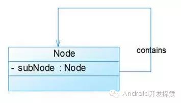
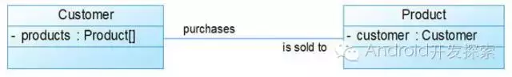
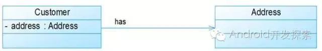

#####接口实现关系
 - 这种关系对应implements关键字，比如下图中，Car类与Ship类都实现了Vehicle接口。
   

#####继承关系
 - 继承关系对应的是extend关键字，在UML类图中用带空心三角形的直线表示，如下图所示中，Student类与Teacher类继承了Person类。

#####依赖关系
 - 从上图中我们可以看到，Driver的drive方法只有传入了一个Car对象才能发挥作用，因此我们说Driver类依赖于Car类。在UML类图中，依赖关系用一条带有箭头的虚线表示。

#####组合关系
 - 组合关系与聚合关系间的最大不同在于：这里的“部分”脱离了“整体”便不复存在。比如下图：
 - 显然，嘴是头的一部分且不能脱离了头而单独存在。在UML类图中，组合关系用一个带实心菱形和箭头的直线表示。
 

#####聚合关系
 - 上图中的Car类与Engine类就是聚合关系（Car类中包含一个Engine类型的成员变量）。
 - 由上图我们可以看到，UML中聚合关系用带空心菱形和箭头的直线表示。
 - 聚合关系强调是“整体”包含“部分”，但是“部分”可以脱离“整体”而单独存在。
 - 比如上图中汽车包含了发动机，而发动机脱离了汽车也能够单独存在。

#####自关联
 - 自关联在UML类图中用一个带有箭头且指向自身的直线表示。上图的意思就是Node类包含类型为Node的成员变量，也就是“自己包含自己”。
 

#####双向关联
 - 从上图中我们很容易看出，所谓的双向关联就是双方各自持有对方类型的成员变量。
 - 在UML类图中，双向关联用一个不带箭头的直线来表示。
 - 上图中在Customer类中维护一个Product[]数组表示一个顾客购买了哪些产品；
 - 在Product类中维护一个Customer类型的成员变量表示这个产品被那个顾客所购买。
 

#####单向关联
 - 我们可以看到，在UML类图中单向关联用一个带箭头的直线表示。
 - 上图表示每个顾客都有一个地址，这通过让Customer类持有一个类型为Address的成员变量来实现。

