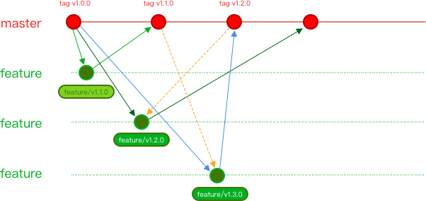

Git分支与版本发布规范：

基本原则：master 为保护分支，不直接在 master 上进行代码修改和提交。
开发流程：
开发日常需求或者项目时，从 master 分支 checkout 创建 feature/* 功能分支进行开发。
完成开发、自测，合并 master 分支到当前开发分支，提交测试（测试组在集成发布时也会先尝试合并 master 代码到提测分支）。
测试通过，发布上线功能分支 feature/*。
发布上线成功后，使用 “Merge Requests” ，请求将开发分支合并到 master。
codeReview，后同意合并。
按照规范生成 CHANGLOG 文档，记录版本更新内容。
创建 master 分支 tag。
分支命名规范：
分支版本命名规则：分支类型/分支创建日期_功能(或是版本)。比如：feature/20181130_promotion
分支类型包括：
feature/* 功能分支
hotfix bug修复分支
refactor 代码重构分支
时间使用年月日进行命名，不足2位补0
功能分支命名使用snake case命名法，即下划线命名。
Tag说明：
Tag包括3位版本，前缀使用v。比如v1.2.2 版本规范参考：语义化版本控制
命名规范：
新功能开发使用第2位版本号，bug修复使用第3位版本号
Git Commit规范：
提交commit必须添加说明！

格式：

actionType: 修改内容
actionType代表某次提交的类型，比如是增加一个新的feature还是修复一个bug。所有的actionType类型如下：

feat: 新增feature
fix: 修复bug
docs: 仅修改了文档，比如README, CHANGELOG, CONTRIBUTE等等
style: 仅修改了空格、格式缩进、都好等等，不改变代码逻辑
refactor: 代码重构，没有加新功能或者修复bug
perf: 优化相关，比如提升性能、体验
test: 测试用例，包括单元测试、集成测试等
chore: 改变构建流程、或者增加依赖库、工具等
revert: 回滚到上一个版本
示例：

fix: 修复内容