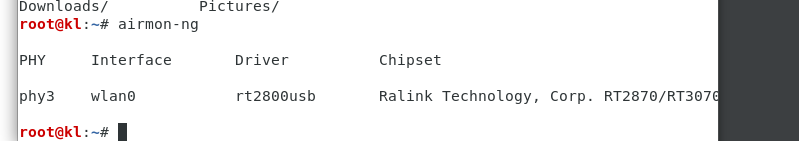
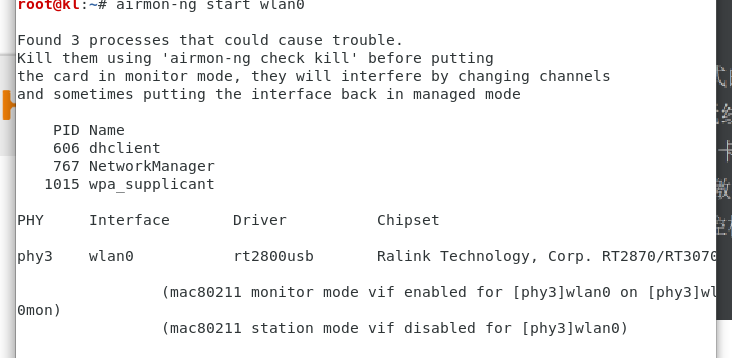
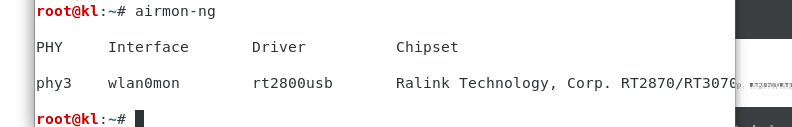
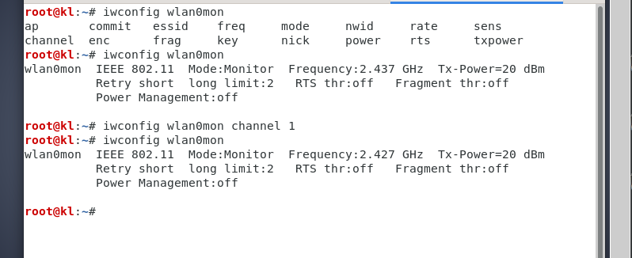

### WLAN以及其固有的隐患

- 2.1 重温WLAN帧
- 2.2 动手实验 -- 创建运行于监控模式的接口
    1. iwconfig：确认系统已检测到无线网卡
    2. ifconfig wlan0 up：激活无线网卡
    3. ifconfig wlan0：检测网卡是否激活
    4. **airmon-ng**：使无线网卡在监控模式下运行
        - airmon-ng：
        - airmon-ng start wlan0：创建与wlan0设备相对应的监控模式接口,
        - airmon-ng：启动监听网卡后，名称会被重新命名为wlan0mon,
        - ifconfig wlan0mon：查看新网卡接口
    5. 已经成功创建一个监控模式接口，可用于捕捉空气中穿行的无线数据包
- 2.3 抓取无线数据包
    - 终端执行，wireshark &，启动Wireshark程序，选中wlan0mon接口进行数据包捕捉
- 2.4 观看管理、控制及数据帧
    - wlan.fc.type == 0：只显示所抓到数据包中的所有管理帧
    - wlan.fc.type == 1：只显示所抓到数据包中的所有控制帧
    - wlan.fc.type == 2：只显示所抓到数据包中的所有数据帧
    - (wlan.fc.type == 0) && (wlan.fc.subtype == 8)：只显示所抓到数据包中的所有管理帧中的信标(Beacon)帧
    - wlan.bssid == {{mac}}：筛选AP数据包
- 2.5 实验环境中数据包的窃取
    - AP加电，保留其不启用加密的配置
    - airmon-ng start wlan0
    - airodump-ng --bssid {{mac address}} wlan0mon：显示该AP及其运行的信道
    - wireshark &：启动Wireshark程序，令其从wlan0mon接口抓取数据包
    - (wlan.bssid == {{mac}}) && (wlan.fc.type_subtype == 0x20)：筛选AP生成的数据包
- 2.6 数据包注入
    - (wlan.bssid == {{mac}}) && !(wlan.fc.type_subtype == 0x08)：筛选出非信标帧
    -  aireplay-ng -9 -e {{name}} -a {{mac}} wlan0mon：向网卡中注入数据包

- 2.8 设置无线网卡
    - iwconfig wlan0 channel 1：设置无线信道
        