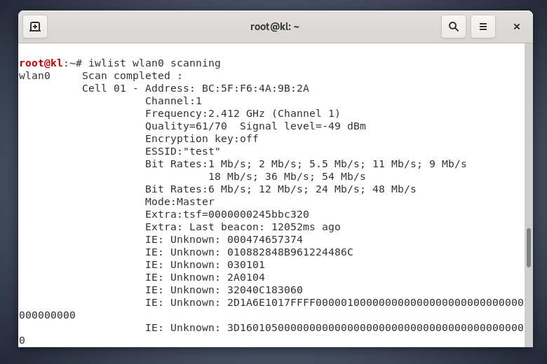
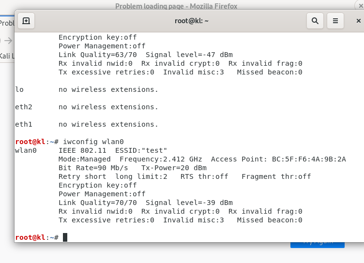
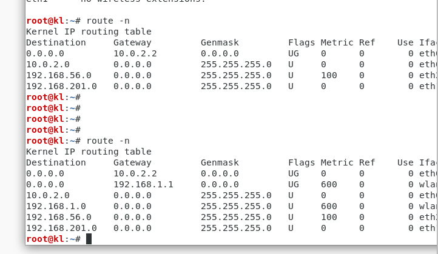
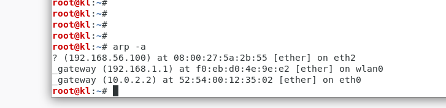

### 准备实验环境

- 1.1 硬件需求
    - 两台配置了内部WiFi网卡的笔记本电脑
    - 一块无线网络适配器
        - Alfa AWUS036H
        - EW-7711UAN无线网卡
        - 一台AP
        - 一条宽带上网线路
- 1.2 软件需求
    - Kali Linux
    - Windows XP/Vista/7/10

- 1.6 配置无线AP
    - 无密码连接无线网络即可，网络名称命名: test

- 1.8 配置无线网卡
    - 将外置无线网卡启用
        1. iwconfig
        2. ifconfig wlan0 up
        3. ifconfig wlan0
    - 扫描AP并连接
        1. iwlist wlan0 scanning
        2. iwconfig wlan0 essid "test"
        3. iwconfig wlan0：检查连接状态
        4. route -n：列出管理接口IP地址
        5. arp -a：验证AP的MAC地址
            - 当客户端连接AP管理界面时，注意是否使用了网络代理软件，目前需要关闭方可正常访问
        6. 
    - 此处参考
        1. [安装网卡驱动](https://forum.aircrack-ng.org/index.php?topic=1114.0)
            ````
            sudo apt-get update && apt-get upgrade -y
            sudo apt-get install linux-headers-$(uname -r)
            cd /usr/src/
            sudo wget https://www.kernel.org/pub/linux/kernel/projects/backports/stable/v4.1.1/backports-4.1.1-1.tar.xz
            sudo tar xvfJ backports-4.1.1-1.tar.xz
            cd backports-4.1.1-1/
            sudo make defconfig-wifi
            sudo make
            sudo make install
            sudo update-initramfs -u
            reboot
            ````


- 1.MAX 突破
    - AP开启WEB模式，尝试用无线网卡与AP建立连接
        - 提示：man iwconfig
    - 由于本人使用iwconfig并未实现上述功能，介绍下面这个利器，如果有哪位可iwconfig实现 请联系我，谢谢：qq：807966224
        - nmcli
            1. nmcli connection：列出已连接网卡
            2. nmcli device wifi：列出可连接网络
            3. nmcli device wifi connection {{name}} password {{password}}：连接某网络
            4. nmcli connection up/down uuid {{uuid}}：激活/关闭某网络
            5. nmcli device status：网卡状态