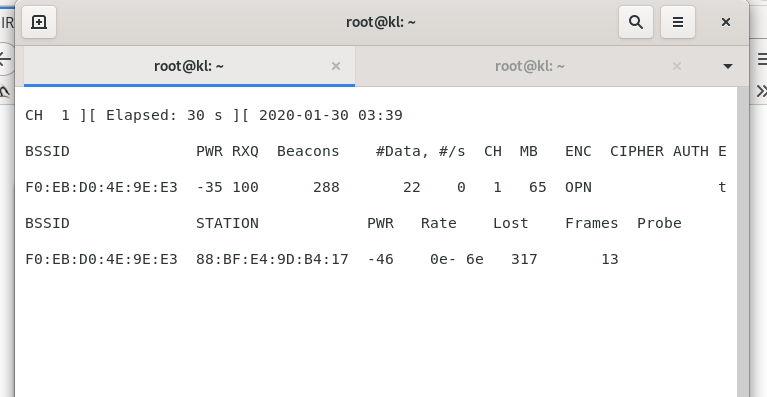
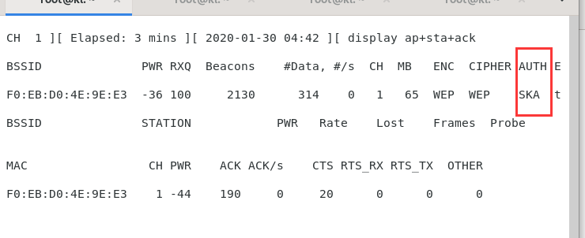

### 规避WLAN验证

- 3.2 隐藏的SSID
    - 设置AP为隐藏模式
    - 通过抓包获取信标帧中得SSID
        1. 等待知道SSID的无线客户端连接AP
        2. aireplay-ng -0 5 -a {{mac}} -- ignore-negative wlan0mon：主动通过AP解除验证数据包
            1. 解除数据包发送后，所有合法用户会重新验证无线客户端，使用wlan.fc.type_subtype == 0x0c，筛选并查看接触验证数据包
            2. 
    - 由于本人路由器暂时不支持这个功能，所以并没有实践，后面我会使用tp-link来实践并完善此例子
    - MAX
        - 有针对性地解除验证

- 3.3 MAC过滤器
    理念：根据无线客户端的MAC地址执行验证，MAC过滤器是指为网络接口分配的标识码，路由器会检查此码，并将其与已获准访问网络的MAC地址列表进行比对
    - macchanger -m {{mac address}} wlan0：这个命令我执行后，要么提示网卡正忙，要么网卡莫名奇妙掉线，没有成功；
        - 后面重新执行后，可以了，解决办法：ifconfig wlan0 down后执行修改mac地址命令即可
        因为我执行修改网卡命令失败，所以我直接在路由器MAC过滤器中新增了我的网卡mac地址，
        这样也算是验证了，当获取到路由器MAC过滤规则中允许得MAC地址，
        还是可以通过更改mac地址得方式进行AP连接
    - airodump-ng -c 10 -a --bssid {{mac address}} wlan0mon：获取AP关联的所有无线客户端的MAC地址
        

    - 总结下针对AP进行MAC过滤器设置的渗透方法
        1. 打开网卡侦听模式
        2. 获取AP MAC地址
        3. 根据AP MAC地址 信道 获取与之连接的无线客户端
        4. 更改网卡MAC地址，连接AP

- 3.8 共享密钥验证
    - 流程：
        1. 客户端发送验证请求至AP
        2. AP回复一段[挑战]文本
        3. 客户端由共享密钥加密文本，并回复给AP
        4. AP解密此文本并与原挑战文本比较，如果一致回复认证成功，否则则失败
    - 开启AP WEP 密钥验证方式
    - 合法客户端连接至AP
    - airodump-ng wlan0mon -c 11 --bssid {{mac}} -w keystream：获取AP密钥流文件，当AUTH变为WEP时即可，
        但是我在实验的时候，使用解除验证指令依然无法获取密钥流，所以我手动切换了wifi后，AUTH栏变为SKA，我只能先这样了
        
    - 因为上一步骤，我并没有获取到xor文件，所以这次我使用命令补偿下：
        aireplay-ng -4 -h {{connected deviceMac}} -a {{ap mac}} wlan0mon，此命令要求受WEP保护的目标无线网络内存在已连接的无线客户端，
        该命令生成具有七篇AMC地址的数据包，来发现XOR流和密钥
    - 又是一个失败的实验，由于我无法生成xor文件，生成的都是cap文件，导致我无法继续实验，希望哪位看到了有想法与我联系，qq:807966224
        

    